**FileFlex Zero Trust Data Access integration with ForgeRock SSO**

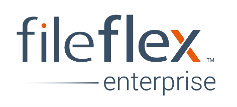

Authenticate, connect and control any enterprise user to secured unstructured data, from any device, on any network to any on-prem or cloud repository in the world. FileFlex is the First Zero Trust Remote Data Access and Sharing Platform for Hybrid-IT Infrastructures. A secure overlay service that unifies remote access, sharing and governance of unstructured data storage across multiple environments using a Zero Trust Architecture. Zero trust is seen by many security leaders as a silver bullet, but it does not cover all aspects of threats and security, such as phishing and sensitive data protection. FileFlex extends Zero Trust Architecture to files and folders.

1. **FileFlex and ForgeRock SSO SAML Integration**

A FileFlex Enterprise Server can integrate with a &quot;ForgeRock&quot; identity provider (IdP) to authorize user access from the endpoint using client software or web application (FileFlex client) to authenticate service access, assign security policies and log all user activities from session log on, to logoff.

This can be enabled globally on any single or clustered FileFlex Server instance, or within containerized units of the deployment on a per-tier level, allowing for multiple ForgeRock IdP&#39;s within a multi-tenant deployment.

The SAML initiator mode is &quot;SP-Initiator mode.&quot;

This document guides the FileFlex server administrator through several common Identity Provider&#39;s (IdP) and Fileflex Server configuration steps for SAML 2.0 auth using FileFlex Enterprise Cloud Connectors on the endpoint.

1. FileFlex Client selects ForgeRock SSO provider for authentication to FileFlex Server
2. FileFlex Server creates a SAML authentication request token and responds with a redirect to ForgeRock (the  identity provider (IdP)).
3. The user follows a redirect to ForgeRock to authenticate, and authenticates to ForgeRock  4. ForgeRock sends the SAML assertion to the Fileflex Server via the Assertion Consumer Service (ACS) URL.  5. The FileFlex Server validates the SAML assertion and sends the SAML session token to the FileFlex Client  6. Session starts.

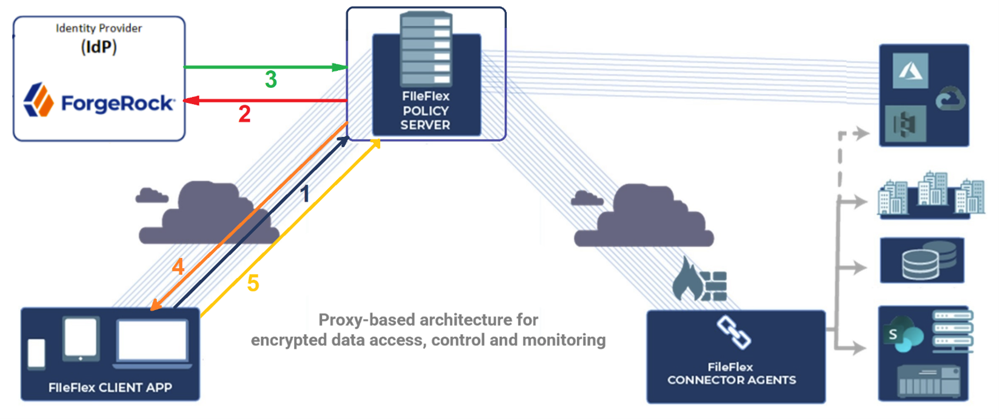

**Single Sign-on with ForgeRock**

This documentation provides a tutorial on how to configure ForgeRock( as IDP) and FileFlex Server ( as SP )  such that FileFlex users can use ForgeRock credentials to authenticate themselves and log in to FileFlex.
* [Creating IDP application on ForgeRock](#creating-idp-application-on-forgerock)
* [Configuring FileFlex using ForgeRock Metadata](#configuring-fileflex-using-forgerock-metadata)
* [Creating SP Application on ForgeRock](#creating-sp-application-on-forgerock)

# Creating IDP application on ForgeRock

As a first step, you need to create IDP application on the ForgeRock interface.

Log in to the AM admin module.

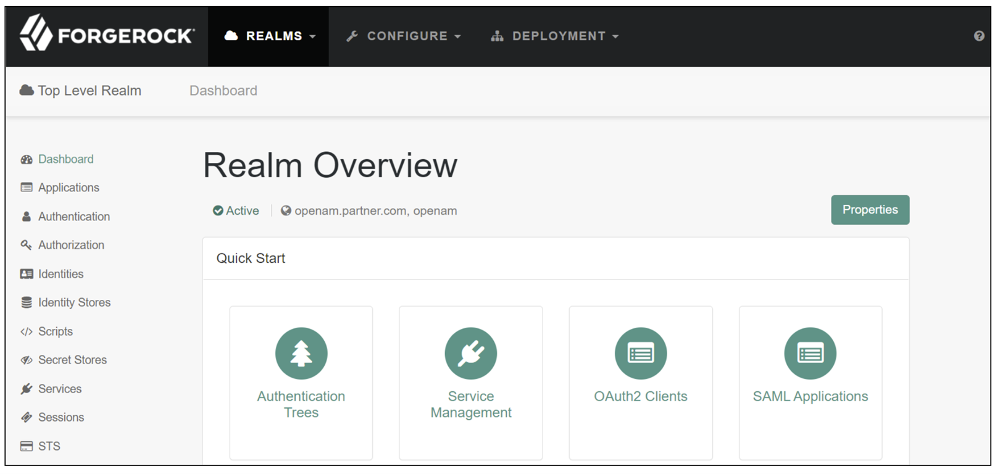

Click SAML Applications

In the example below, we will add a Hosted IDP application.

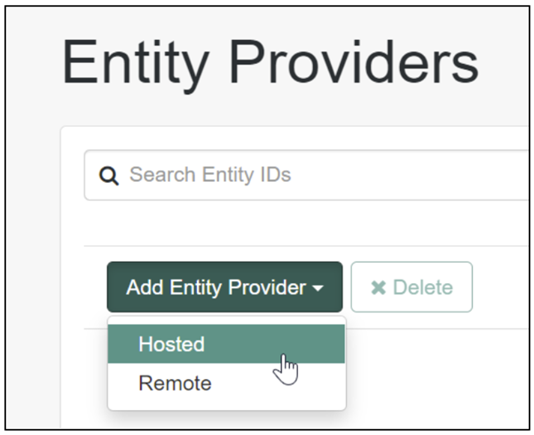

Select &quot;Hosted&quot; as the first step towards creating the application.

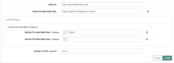

Fill in the provider details based on your security settings.

The minimum required for FF to work is as below

Entity ID : Provide in URL format, the public facing, fully qualified Domain that the FileFlex Server uses. i.e. https://qnext.fileflexdemo.com

Identity provider Meta Alias: ( Any string for identification purpose)

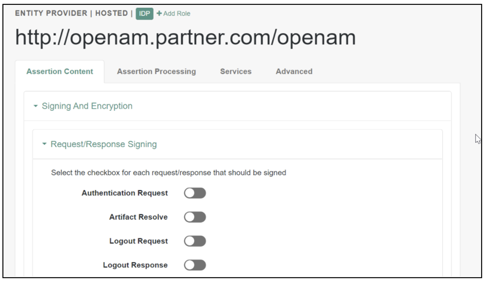

In the next step ensure, nameid field does contain emailAddress as mapping criteria (item 3 in below example)

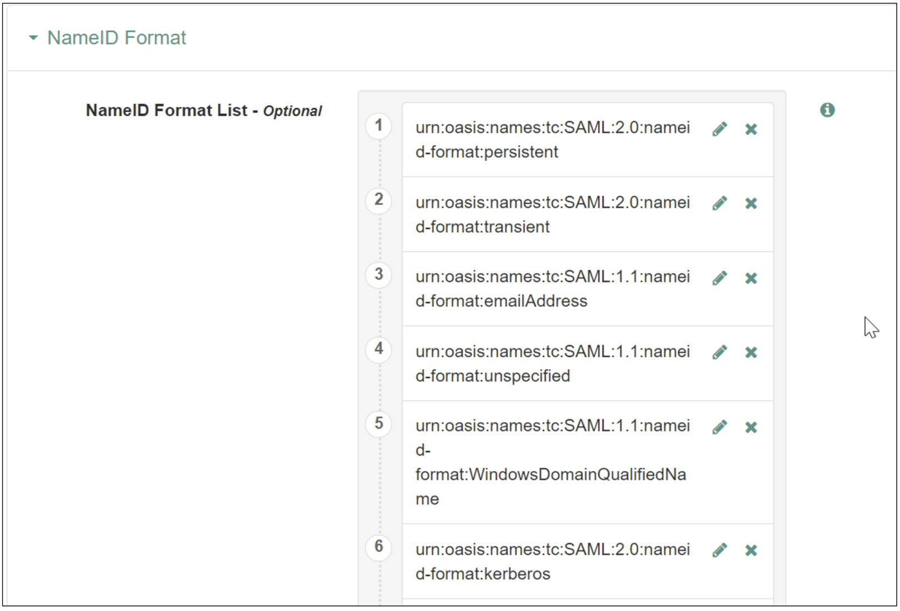

Other details are optional and can be left empty or filled based on your organization&#39;s requirements

Once applications is created, you need to download the IDP XML as that will be required in next step when we configure the FF server with ForgeRock details.

**How to download IDP XML:**

This is explained in detail in ForgeRock documentation.

[https://backstage.forgerock.com/docs/am/7/saml2-guide/saml2-providers-and-cots.html](https://backstage.forgerock.com/docs/am/7/saml2-guide/saml2-providers-and-cots.html)

**Example from forgerock documentation**

curl --output metadata.xml &quot;[https://openam.example.com:8443/openam/saml2/jsp/exportmetadata.jsp?entityid=myHostedProvider&amp;realm=/mySubRealm](https://openam.example.com:8443/openam/saml2/jsp/exportmetadata.jsp?entityid=myHostedProvider&amp;realm=/mySubRealm)&quot;

# Configuring FileFlex using ForgeRock Metadata

Login to FileFlex Server Admin console and naviagte to Control panel → Single Sign-On section and locate ForgeRock Section.

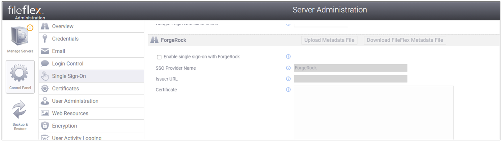

Enable single sign-on with the ForgeRock option, so that you can upload the IDP XML to it.

Once the option is enabled, &quot; Upload Metadata File&quot; is enabled. Click on that upload the ID.xml downloaded in the previous section.

Once done, you should see as below:

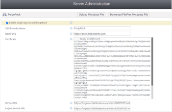

Click Apply to save the changes.

You will be prompted to restart the server. Once you restart changes will be applied to it.

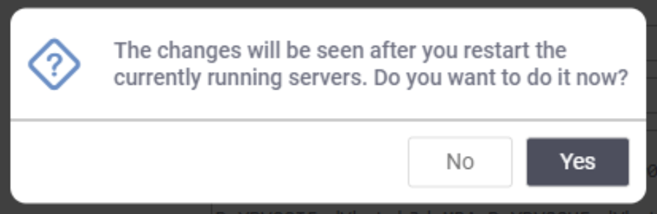

Once the changes are applied, download the SP ( FileFlex) metadata so that FileFlex server information can be provided to ForgeRock in the form of an SP application.

Click &quot;Download FileFlex Metadata File&quot;  and save to your local device as an XML file.  This will be required in the next section where the SP application would be created in ForgeRock.

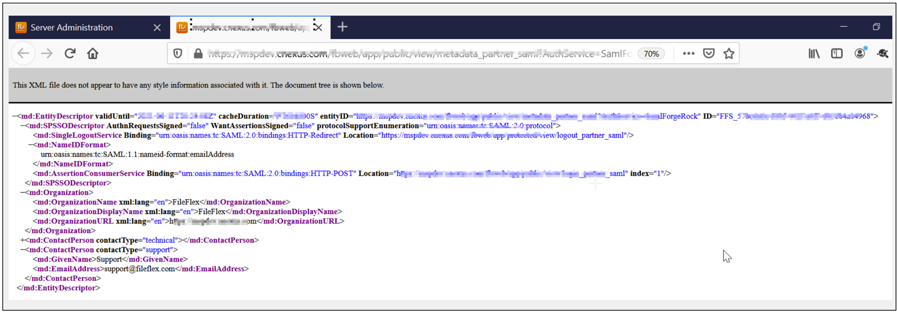

# Creating SP Application on ForgeRock

In the final step, we will create SP Application thus providing details of FileFlex Server to ForgeRock.

Log in to the AM admin module.

Click SAML Applications

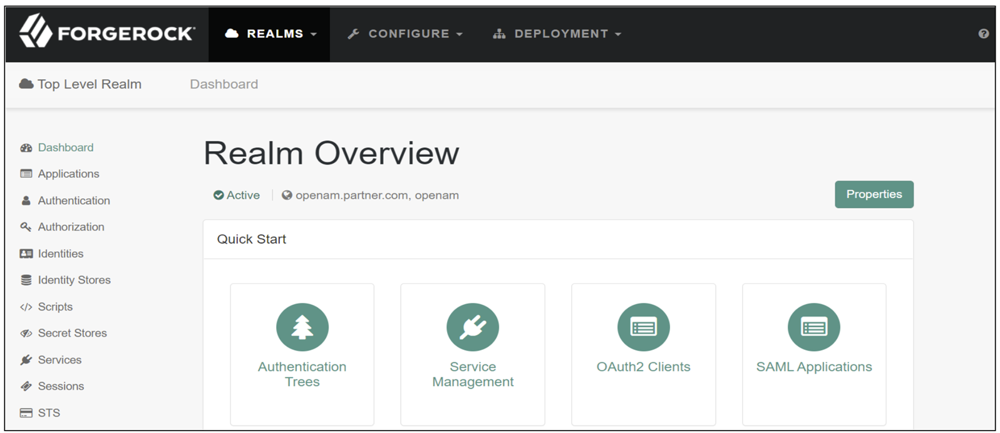

Select &quot;Remote&quot; from the drop-down as shown below.

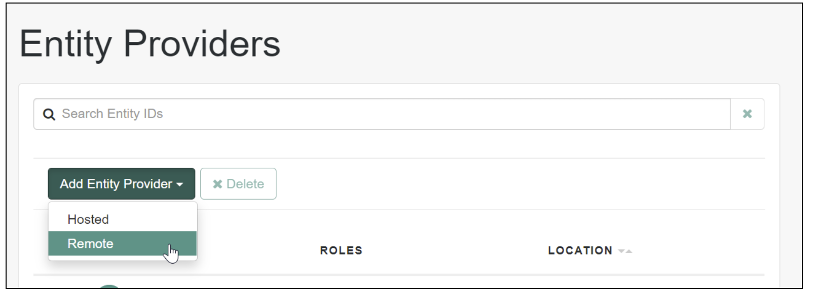

Upload the  SP metadata file save in the previous step from the local device.

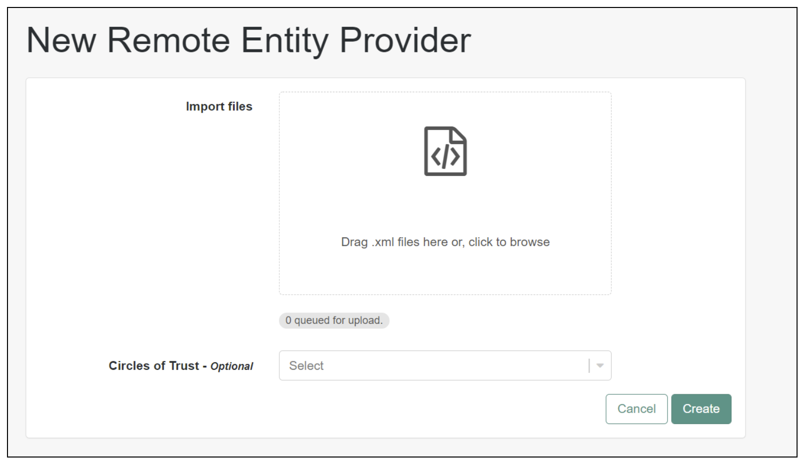

ForgeRock requires both SP and IDP apps under the same circle of trust.

Therefore, ensure both apps are under the same circle of trust.

Click &quot; **Create**&quot; and this completes the configuration process.

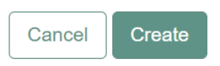
